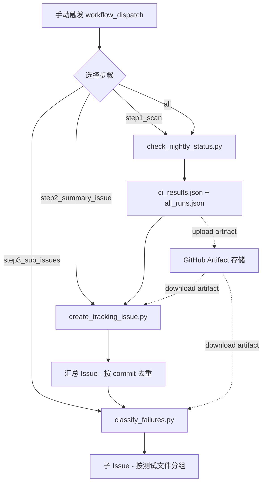

# XPU CI Break Monitor 使用说明

## 概述

本工具自动监控 PyTorch XPU CI 的 nightly schedule 运行结果，识别失败用例，创建汇总 issue 并按测试文件分类创建子 issue。

## 架构

```
workflow_dispatch (手动触发)
    │
    ├─ Step 1: 扫描 CI ─────→ ci_results.json + all_runs.json
    │
    ├─ Step 2: 创建汇总 issue ─→ GitHub Issue (按 commit SHA 去重)
    │
    └─ Step 3: 分类 + 子 issue ─→ 按测试文件分组的子 issue
```

## GitHub Actions Workflow 使用

### 触发方式

仅支持手动触发。进入 GitHub repo → Actions → **XPU CI Break Monitor** → **Run workflow**。

### 输入参数

| 参数 | 类型 | 默认值 | 说明 |
|------|------|--------|------|
| `steps` | 下拉选择 | `all` | 运行哪些步骤：`all` / `step1_scan` / `step2_summary_issue` / `step3_sub_issues` |
| `days` | 字符串 | `3` | 向前查找多少天的 CI 运行记录 |
| `parse_logs` | 布尔 | `true` | 是否解析 job 日志提取具体测试用例名 |
| `summary_issue_number` | 字符串 | 空 | 单独运行 step3 时需提供汇总 issue 编号 |

### 使用场景

#### 场景 1：完整流程（推荐）

选择 `steps = all`，会依次执行：
1. 扫描最近 N 天的 schedule CI 运行，对比最近两次结果
2. 如有失败，创建汇总 issue（同一 commit 不重复创建）
3. 按测试文件分类，为每组创建子 issue

#### 场景 2：只扫描不创建 issue

选择 `steps = step1_scan`。结果保存为 artifact，后续可单独运行 step2/step3。

#### 场景 3：基于已有扫描结果创建 issue

选择 `steps = step2_summary_issue`。会自动下载上次 step1 上传的 artifact。

#### 场景 4：只创建子 issue

选择 `steps = step3_sub_issues`，并填写 `summary_issue_number`（已有汇总 issue 编号）。

---

## 本地运行

### 前提

```bash
export GITHUB_TOKEN=ghp_xxxx   # 需要 repo scope
pip install requests
```

### Step 1: 扫描 CI

```bash
python tools/ci_monitor/check_nightly_status.py \
    --days 3 \
    --event schedule \
    --num-runs 2 \
    --parse-logs \
    --output ci_results.json \
    --save-all-runs all_runs.json
```

**参数说明：**

| 参数 | 说明 |
|------|------|
| `--days N` | 查找最近 N 天的运行记录 |
| `--event schedule` | 筛选触发类型（`schedule` / `push` / `pull_request`） |
| `--num-runs 2` | 取最近 2 次非取消的 schedule 运行做对比 |
| `--parse-logs` | 解析 job 日志提取失败测试用例名称 |
| `--output FILE` | 输出 JSON 文件路径 |
| `--save-all-runs FILE` | 保存所有运行记录（含 push），用于后续 bisect |

**输出 JSON 关键字段：**

- `status`: `HAS_FAILURES` 或 `ALL_PASS`
- `commit_sha`: 最新运行的 commit
- `new_failed_tests`: 本次新增的失败（上次通过，这次失败）
- `existing_failed_tests`: 持续存在的失败（两次都失败）
- `fixed_tests`: 本次修复的用例（上次失败，这次通过）

### Step 2: 创建汇总 issue

```bash
python tools/ci_monitor/create_tracking_issue.py \
    --input ci_results.json \
    --all-runs all_runs.json
```

| 参数 | 说明 |
|------|------|
| `--input FILE` | Step 1 输出的 ci_results.json |
| `--all-runs FILE` | 可选，all_runs.json 用于在 issue 中展示 push runs 时间线 |
| `--dry-run` | 只打印 issue 内容，不实际创建 |

**去重逻辑：** 按 commit SHA 前 12 位匹配。同一 commit 的 issue 已存在则更新，不同 commit 创建新 issue。

### Step 3: 分类 + 创建子 issue

```bash
python tools/ci_monitor/classify_failures.py \
    --input ci_results.json \
    --summary-issue 2 \
    --days 7
```

| 参数 | 说明 |
|------|------|
| `--input FILE` | ci_results.json |
| `--summary-issue N` | 汇总 issue 编号，子 issue 会引用它 |
| `--days N` | 查找 PyTorch 仓库最近 N 天的 git 提交历史用于归因 |
| `--dry-run` | 只打印分类结果，不创建子 issue |

**分类类别：**

| 类别 | 含义 |
|------|------|
| `NEW_TEST` | 新增的测试用例，可能缺少 XPU 支持 |
| `UPSTREAM_REGRESSION` | 社区 PR 导致 XPU 路径回归 |
| `XPU_BACKEND_BUG` | XPU 后端或 inductor 需要修复 |
| `TOLERANCE` | 精度容差需调整（参考 CUDA 容差） |
| `SKIP_STALE` | 需移除过期的 `@skipIfXpu` 或 `@expectedFailure` |
| `INFRA` | 环境、import 或基础设施问题 |

---

## 数据流图



## 常见问题

**Q: 为什么只看 schedule 触发的 CI？**
A: Schedule 运行基于 main 分支最新代码，能真实反映 nightly 状态。Push 和 PR 触发的运行对应特定提交，不代表整体状态。Push 运行作为 bisect 参考保存。

**Q: 105 个失败 vs HUD 只显示 3 个？**
A: 使用 `--num-runs 2` 对比两次 schedule 运行后，可区分 NEW（新增）和 EXISTING（历史遗留）失败。HUD 通常只显示新增的。

**Q: 同一个 commit 重复运行会创建多个 issue 吗？**
A: 不会。脚本通过 commit SHA 前 12 位搜索已有 issue，存在则更新，不存在才新建。
